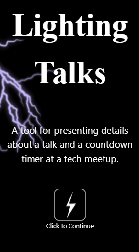
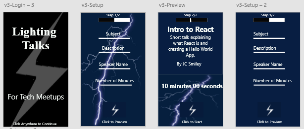

# Lighting Talks

### Table of Contents

1. Demo Link
2. Purpose
3. Motivation
4. Objectives
5. Wireframe
### Project production Link: [Lighting Talks](https://lighting-talks.netlify.com/)

### Purpose:

 A tool for presenting details about a talk and a countdown timer at a tech meetup.

### Motivation:

This project was used to practice developing with React and deloying to Netlify.

### Objectives:

- Allow the user to input a talk's title, description, speaker's name, and number of minutes
- Practice using images and animation to improve user experience. Practice deploying to Netlify.

### WireFrame

### This app was built with the following technologies:

**React:** JavaScript front-end library for building user interfaces

**Git-Hub:** Web-based version control repository and Internet hosting service

**Abode XD** A wire-framing tool used to create a mockup/visual of what is to be coded

**JavaScript:** Object-oriented programming language for web pages

**HTML:** Mark-up language for creating web pages

**CSS:** A formatting language for styling web pages

_Create by JC Smiley in January of 2020_
